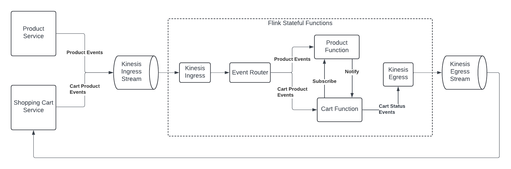

# Example Flink Stateful Functions Java Project

## Overview

This is an example of a Flink Stateful Functions project implemented in Java which uses the statefun embedded sdk.

The purpose of this project is two-fold.  
 1. It demonstrates how Imagine Learning implements stateful functions, with only a few key differences, namely
    * This project uses JSON-formatted [CloudEvents](https://github.com/cloudevents/spec?tab=readme-ov-file#cloudevents) 
      because it avoids the messy deserialization required when processing 
      [Caliper](https://www.imsglobal.org/spec/caliper/v1p2) events.
    * This project egresses results as events to a separate stream, whereas at Imagine Learning we mostly send our 
      results directly to OpenSearch and occasionally write events back to the ingress stream.
 2. It will serve as the basis for an evaluation of Stateful Functions running on 
    [AWS Managed Flink](https://docs.aws.amazon.com/managed-flink/).  At the time of
    this writing Imagine Learning runs stateful functions on self-managed Kubernetes clusters, but we are looking to
    see if AWS Managed Flink is a viable alternative.


This project demonstrates stateful functions under test in various ways:
  * build-time isolated function tests in which a single function is tested using events defined in a test resource file 
  * build-time integration tests in which several functions at once are tested using events from a test resource file
  * run-time execution in standalone job mode via docker compose


The project implements embedded functions (functions that execute in the Flink taskmanagers).  Remote functions are future work.

This is an opinionated project.  It uses...
  * Spring Framework for dependency injection
  * Kinesis streams for ingress/egress
  * CloudEvents serialized to JSON are the Kinesis payloads
  * Protobuf envelopes wrap the CloudEvents between ingress deserialization and egress serialization.
  * The router logic and stateful functions work with the CloudEvents, not the Protobuf envelopes.
  * The custom annotation `@StatefunFunction` is used to find the stateful
    function implementations and bind them without having to write boilerplate code.
  * The router implementation relies on Spring to provide the list of 
    `com.example.stateful_functions.router.Forwarder` implementations.  
    Each forwarder is small piece of code that routes one or more specific event types
    to a stateful function.  To start routing a new event type, just implement another Forwarder.

## What this Stateful Functions appication does
Example events and functions are provided which demonstrate notifying a shopping cart service of 
product price and availability changes for items in users' carts.  The project assumes the 
existence of upstream microservices that send Product events (name,price,availability) and
Cart Action events (add product to cart, delete cart, etc), and a 
downstream service which handles cart item price and availability changes.  Two 
functions are provided... 1) a product function which stores the
current details for each product, including price and availability, 
2) A cart function which interacts with the product function via function-to-function
messaging.  The cart function egresses a cart status event containing the information
required to display product price/availability changes to the user.

This project demonstrates the following event scenario:
  * The product service sends a product event to declare the product name, description, 
    price, and availability.
  * The cart service sends a cart product event when a product is added to the cart.
  * Product events are routed to the product function
  * Cart product events are routed to the cart function
  * The cart function subscribes to the product via internal messaging to the product function
  * Later, a product event is sent which indicates an increase of the price of the product
  * The product function sends the latest product info to the subscribers (i.e, the cart function)
  * The cart function compares the two prices, and egresses a cart status event 
    with the price discrepancy for the product.
  * The downstream systems could email the user on a price decrease (hurry, the item is on sale!),
    or show a price change alert to the user when they next visit their cart, etc.

Note that the product service and shopping cart service are not part of this example project.
Example inbound events can be found in the [src/test/resources](./src/test/resources) directory.



## Running the isolated and integration tests 
To build and run the tests, use JDK 11 or greater (I'm using JDK 15).

Users running on Apple silicon should ensure that the file ~/.m2/settings.xml exists and contains the following:
```
<settings>
  <activeProfiles>
    <activeProfile>
      apple-silicon
    </activeProfile>
  </activeProfiles>
  <profiles>
    <profile>
      <id>apple-silicon</id>
      <properties>
        <os.detected.classifier>osx-x86_64</os.detected.classifier>
      </properties>
    </profile>
  </profiles>
</settings>
```


To compile the code and run the tests using the included Maven wrapper script, first see below about
building and installing Apache Flink Stateful Functions compatible with Flink 1.18, then do this:
```
./mvnw test
```

## Running the project via Docker Compose

Follow the instructions below to run the project via Docker Compose.  Note that Kinesis support is provided
by a [localstack](https://www.localstack.cloud/) container.

The demo works using three docker compose "profiles" (phases).
1. In the first phase, the flink cluster running our stateful function application is started,
   along with localstack, and an aws-cli container that creates the ingress and egress Kinesis streams.
2. The second phase runs an aws-cli container to send events to the ingress stream.  The events
   sent are from [product-cart-integration-test-events.jsonl](./src/test/resources/product-cart-integration-test-events.jsonl)
3. The third phase runs an aws-cli container to fetch the events from the egress stream and output them to the console.
```shell
# Build this project and create the jar file
./mvnw package

# Build the flink docker images, and re-run these if code changes have been made
docker compose build jobmanager
docker compose build taskmanager

# The statefun profile starts localstack, creates the kinesis streams, and starts the Flink jobmanager and taskmanager
docker compose --profile statefun up -d

# Optionally connect the IDE debugger to the taskmanager on localhost port 5066 at this point

# Send some events
docker compose --profile send-events up

# Get and display the events from the egress stream
# Note that some VPNs (i.e., ZScaler) can cause failures with 'yum'.  The workaround is to disconnect from the VPN first.
docker compose --profile get-egress-events up

# Shut everything down
docker compose --profile all down
```

## Running the project via AWS Managed Flink

### Version compatibility between AWS Managed Flink and Stateful Functions

The latest release of Apache Flink Stateful Functions is 3.3, but its compiled and built 
to run with Flink 1.16.2.  AWS Managed Flink supports Flink versions 1.15 and 1.18.  So the first
step towards running via AWS Managed Flink is to create a version of the stateful functions library 
compatible with Flink 1.18.  The required changes are provided here: 
https://github.com/kellinwood/flink-statefun/pull/1/files.  
Clone that repo, checkout the `release-3.3-1.18`
branch, and build/install it locally via `mvn install`

### Build and package this project
```shell
mvn package
```

The demo can be provisioned in AWS in three ways... via CloudFormation, Terraform, or Crossplane

### Provisioning via AWS CloudFormation

The templates and scripts used for provisioning the AWS resources via CloudFormation are in the [aws-cloudformation](./aws-cloudformation) directory.
```
cd aws-cloudformation
```

#### Create an S3 bucket and upload this project's JAR file

To create the bucket, create a CloudFormation stack named `flink-cf-demo-bucket` as defined [here](./aws-cloudformation/flink-cf-demo-bucket-stack.yaml),
and after that finishes, use the AWS CLI to upload the jar file:

```shell
export AWS_ACCOUNT_ID=516535517513 # Imagine Learning Sandbox account
aws s3 cp ../target/my-stateful-functions-embedded-java-3.3.0.jar s3://flink-cf-demo-bucket-${AWS_ACCOUNT_ID}/
```

#### Create the Kinesis streams, Managed Flink application, and related AWS Resources

Create a CloudFormation stack named `flink-cf-demo` as defined by the CloudFormation templates [here](./aws-cloudformation/flink-cf-demo-stack.yaml).
This stack includes a custom resource lambda that programmatically configures logging when the Flink application is created,
and transitions the application from the Ready to Running state.


#### Monitor the CloudWatch logging output

The following script will show all the log entries from the start of application launch, and will
wait for new entries to arrive and display them too.  The script will resume from where it
left off if shut down via Ctrl-C.  To start from scratch, remove the `.cwlogs` directory.
```shell
./demo-tail-logs.sh
```

### Send sample events to the ingress stream
```shell
./demo-send-events.sh
```

#### Get and display the events published to the egress stream
This script will show all events published to the egress stream since the start of application launch, and will
wait for new entries to arrive and display them too.
```shell
./demo-tail-egress.sh
```
#### Cleanup
Cleanup by manually deleting the jar file from the S3 bucket and the ingress Kinesis stream.  Then delete the 
Cloud Formation stacks. Cloud Formation will fail to delete a non-empty bucket, and fail to delete the ingress Kinesis 
stream since Flink adds a fanout consumer to the stream which will block the deletion attempted by
Cloud Formation.

### Provisioning via Terraform

Requires installing the [Terraform CLI](https://developer.hashicorp.com/terraform/tutorials/aws-get-started/install-cli)

Steps

```shell
cd aws-terraform
# Configure your AWS profile, set AWS env vars, or run 'aws configure sso', etc
terraform init
terraform apply # When prompted, enter 'yes'
```
Immediately after entering 'yes' to the prompt issued by `terraform apply`, switch to another shell/terminal tab and 
upload the application JAR file to the S3 bucket.  The upload may fail if the S3 bucket has not been created by 
Terraform yet, so keep trying until it succeeds.

```shell
export AWS_ACCOUNT_ID=516535517513 # Imagine Learning Sandbox account
aws s3 cp ../target/my-stateful-functions-embedded-java-3.3.0.jar \
          s3://flink-demo-bucket-${AWS_ACCOUNT_ID}/
```
Wait for the `terraform apply` command to complete.

#### Monitor the CloudWatch logging output

The following script will show all the log entries from the start of application launch, and will
wait for new entries to arrive and display them too.  The script will resume from where it
left off if shut down via Ctrl-C.  To start from scratch, remove the `.cwlogs` directory.
```shell
./demo-tail-logs.sh
```

#### Send sample events to the ingress stream
```shell
./demo-send-events.sh
```

#### Get and display the events published to the egress stream
This script will show all events published to the egress stream since the start of application launch, and will
wait for new entries to arrive and display them too.
```shell
./demo-tail-egress.sh
```

#### Cleanup
Cleanup by manually deleting the jar file from the S3 bucket, `flink-demo-bucket-${AWS_ACCOUNT_ID}`, and the Kinesis 
stream `flink-tf-demo-ingress`.  Run the `terraform destroy` command.  Note that the manual deletions are required 
since Terraform can't delete a non-empty bucket, and can't delete the ingress stream since Flink adds a fanout consumer 
to the stream which will block the deletion attempted by Terraform.

Alternatively, you can run the following commands to clean up the resources:
```shell
export AWS_ACCOUNT_ID=516535517513 # Imagine Learning Sandbox account
aws s3 rm --recursive s3://flink-tf-demo-bucket-${AWS_ACCOUNT_ID}/
aws kinesis delete-stream --enforce-consumer-deletion --stream-name flink-tf-demo-ingress
terraform destroy # When prompted, enter 'yes'
```

### Provisioning via Crossplane

#### Prerequisites:
- Docker
- idpbuilder (https://github.com/cnoe-io/idpbuilder)
- kubectl
- jq
- python3

#### Introduction
This demo of provisioning via Crossplane is nowhere near production quality.  It merely demonstrates that it is possible 
to provision and run an AWS Managed Flink application via crossplane.  Many tasks normally performed via CI/CD must be 
completed manually as described below.  The crossplane compositions currently use `function-patch-and-transform` instead 
of a custom composition function, and because of that, many things in the compositions remain hard-coded (AWS account 
number, region, ARNs in IAM roles, etc).  


#### Instructions

The files to run the crossplane demo are in the [aws-crossplane](./aws-crossplane) directory.
```
cd aws-crossplane
```

##### Start the local IDP configured to use AWS

Login to AWS Identity Center, and copy the AWS credential environment variables commands from Access Keys page.

Paste and execute the AWS environment variable commands, then run this script:

```
./cloud/aws/update_credentials.sh
```

Launch the local IDP using idpbuilder (https://github.com/cnoe-io/idpbuilder)

```
idpbuilder create -p ./cloud/aws
```

The `idpbuilder create` command takes a few minutes to complete, and even then it will take more time for crossplane to 
start and the providers to be loaded.

Wait for the AWS providers to finish loading...

```
kubectl -n crossplane-system get pods | grep provider-aws
```

Wait until the command above returns a list of pods all in the `Running` state.

##### Install the Crossplane resources (XRDs and Compositions)
Install the Composite Resource Definitions and Compositions required by the demo. Ignore the warnings issued by the 
following command:

```
for i in $(find resources -name \*xrd.yaml -o -name \*comp.yaml); do k apply -f $i; done
```

At the time of this writing the demo does not utilize a custom composition function.  Instead, it uses the off-the-shelf 
function `function-patch-and-transform` which gets loaded during IDP creation, above.

##### Provision AWS Managed Flink via Crossplane claims

Provision the S3 bucket and Kinesis streams...
```
kubectl apply -f claims/demo-setup-claims.yaml
```

Wait for the resources to become synchronized and ready by checking the output of the following command:
```
kubectl get managed
```
The output of `kubectl get managed` will reveal the actual S3 bucket name under `EXTERNAL-NAME`.

Return to AWS Identity Center and launch the web console for the account.

Visit the S3 services page.  Find the S3 bucket (flink-demo-bucket-*) and upload the following file to the bucket
- `../target/my-stateful-functions-embedded-java-3.3.0.jar` (Flink demo application code)

Alternatively, use the AWS CLI to upload the file...
```
flink_bucket_name=$(kubectl get managed | grep bucket | awk '{print $4}')
aws s3 cp ../target/my-stateful-functions-embedded-java-3.3.0.jar s3://${flink_bucket_name}/
```

##### Provision the Managed Flink application  

Apply the following claim to trigger the creation of the Flink application, its role, and log groups.  Note that by 
default Flink application will become 'Ready' since `startApplication: true` is commented-out in the claim.  Do not
uncomment this line yet.

```
kubectl apply -f claims/managed-flink-claim.yaml
```

Visit the AWS Managed Flink applications page in the web console.  When the application status becomes `Ready`, 
uncomment the `startAppication: true` line in the `managed-flink-claim.yaml` file and re-run 
the `kubectl apply -f claims/managed-flink-claim.yaml` command.  If the initial claim apply is performed 
with `startApplication: true` then Crossplane appears to go into a loop where it updates the application every few 
minutes, and so it switches back and forth between `Running` and `Updating` :(


Wait until the Flink application is in the 'Running' state. This may take a few minutes.

#### Monitor the CloudWatch logging output

The following script will show all the log entries from the start of application launch, and will
wait for new entries to arrive and display them too.  The script will resume from where it
left off if shut down via Ctrl-C.  To start from scratch, remove the `.cwlogs` directory.
```shell
./demo-tail-logs.sh
```

#### Send sample events to the ingress stream
```shell
./demo-send-events.sh
```

#### Get and display the events published to the egress stream
This script will show all events published to the egress stream since the start of application launch, and will
wait for new entries to arrive and display them too.
```shell
./demo-tail-egress.sh
```

#### Cleanup

Manually delete the files in the S3 bucket, and delete the Kinesis stream `flink-demo-ingress` (the Flink application 
adds a fanout consumer to the stream which will block any deletion attempted by Crossplane).

Run the following commands to delete the remaining resources:
```
kubectl delete -f resources/claims/managed-flink-claims.yaml
kubectl delete -f resources/claims/demo-setup-claims.yaml
```

Shut down the local IDP with the command:
```
idpbuilder delete
```

